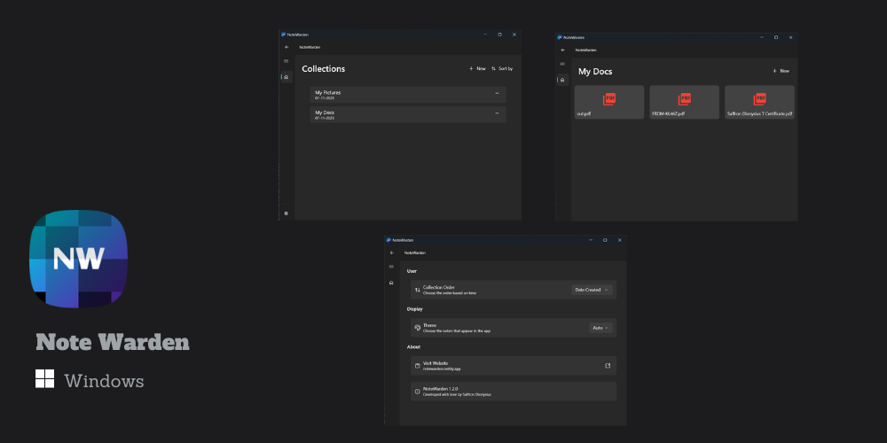

  

 <h1 align="center">Note Warden</h1>

  
  
  

Note Warden is a user-friendly app that allows users to conveniently store and manage various types of notes, including images and PDFs. 
<!-- It is designed for students and individuals who deal with files. -->

## 📸 Screenshots

<!-- 

 -->

## 👨‍💻 Authors

- [@saffron-codes](https://www.github.com/saffron-codes)
- [@rajeshwar3](https://www.github.com/rajeshwar3)

